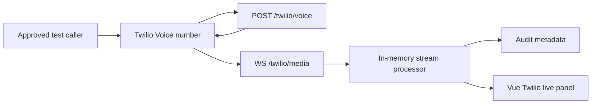
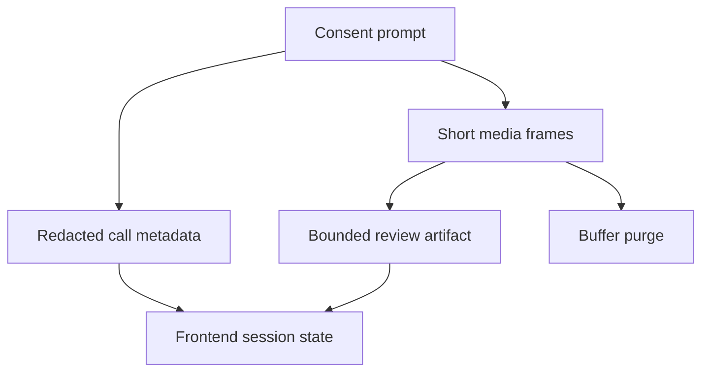

# Twilio Demo And Risk Assets

These assets support the Twilio AI Startup Searchlight application and the next
implementation sprint. Keep them aligned with the pre-alpha supervised
education boundary.

## Consent IVR Branch

Primary English prompt:

Hello. This V.O.T Guardian educational demo uses Twilio to stream call audio for
supervised review. It is not an emergency service and does not make identity or
fraud accusations. Raw audio is not stored by the gateway. Press 1 to continue
or hang up to decline.

Primary French prompt:

Bonjour. Cette demonstration educative V.O.T Guardian utilise Twilio pour
transmettre l audio de l appel vers une revue supervisee. Ce service n est pas
un service d urgence et ne pose pas d accusation d identite ou de fraude.
L audio brut n est pas conserve par la passerelle. Appuyez sur 1 pour continuer
ou raccrochez pour refuser.

No-consent branch:

No consent was received. The call will now end.

## School Demo Script

1. State that this is a supervised cybersecurity education demo.
2. Call the Twilio number from an approved test phone.
3. Let the consent prompt finish.
4. Press 1 to continue.
5. Speak a short synthetic scenario, not a real private incident.
6. Open the V.O.T Guardian Twilio live panel.
7. Show the session status, frame count, metadata, and review artifact.
8. Point out the human review required state.
9. Point out that raw audio is not retained by the gateway.
10. End with the boundary: classroom review only, no autonomous decision.

## Supporter Demo Script

1. Start with the problem: voice AI risk needs consent, privacy, and human
   review, not black-box accusations.
2. Show Twilio as the live communications layer.
3. Show one end-to-end workflow from inbound call to review artifact.
4. Show the architecture: Twilio Voice, Media Streams, Flask gateway, in-memory
   processor, audit metadata, Vue review panel.
5. Explain why SMS is deferred until Verify or A2P 10DLC is ready.
6. Close with the ask: credits and technical review to move from local pilot to
   a safe public demo.

## Technical Diagram

## Data Flow Diagram

## Risk Matrix

| Risk | Impact | Mitigation | Status |
| --- | --- | --- | --- |
| Caller does not consent | Privacy violation | Fail closed and hang up | Implemented |
| Signature validation fails | Spoofed webhook | Reject with 403 | Implemented |
| Raw audio retained by accident | Privacy breach | In-memory only and buffer purge tests | Implemented |
| Review artifact overclaims | Reputation and safety risk | Bounded labels and human review wording | Implemented |
| Public URL mismatch | Twilio webhook failure | Runbook checklist and Debugger review | Documented |
| SMS launched too early | Compliance risk | Voice-only phase and A2P blocker | Documented |

## Misuse Boundary Matrix

| Boundary | Allowed | Blocked |
| --- | --- | --- |
| Education | Synthetic classroom scenarios | Real private incidents without approval |
| Identity | Evidence quality discussion | Biometric identity claims |
| Safety | Human review prompt | Emergency response workflow |
| Enforcement | Awareness and audit metadata | Law-enforcement accusation |
| Retention | Session metadata and review labels | Raw audio storage |
| Messaging | Future Verify or A2P reviewed path | Premature SMS blast |

## Chrome Submission Walkthrough

1. Open the Proton message from Twilio Startups Team.
2. Open the official Twilio AI Startup Searchlight page.
3. Confirm the URL is `https://www.twilio.com/en-us/lp/twilio-ai-startup-searchlight`.
4. Confirm a Twilio account is active.
5. Select the Breakthrough Builders track unless real scaled traction supports a
   different choice.
6. Paste sanitized answers only.
7. Attach or paste the demo link only after the video is reviewed.
8. Stop before the final submit button and request explicit confirmation.

## Post-Submission Follow-Up Email

Subject: V.O.T Guardian Twilio Media Streams pilot

Hello,

Thank you for reviewing V.O.T Guardian for Twilio AI Startup Searchlight 2026.
The project is a supervised educational voice-risk review pilot that uses
Twilio Programmable Voice and Media Streams for a consent-first live demo.

The current scope is voice-only. SMS and messaging are deferred until the
correct Verify or A2P path is ready. I can provide the demo link, webhook flow,
data retention notes, or a short technical walkthrough if useful.

Jean-Sebastien Beaulieu
