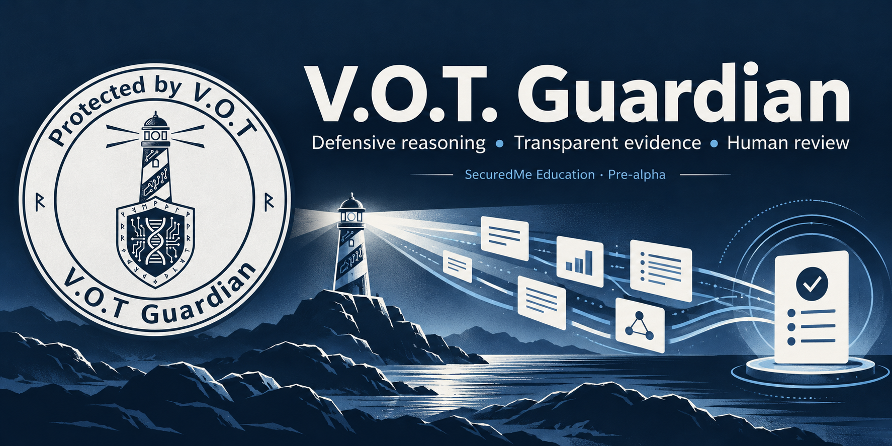

# V.O.T. Guardian



[](LICENSE)
[](AGENTS.md)
[](https://github.com/SeCuReDmE-main-dev/V.O.T-Guardian/issues)
[](https://github.com/SeCuReDmE-main-dev/V.O.T-Guardian/commits/main/)
[](https://e2b.dev/startups)

Study uncertain voice-risk indicators, signal quality and evidence review using synthetic audio.

[Public surface](https://vot-guardian.securedme.ca/) · [Tool documentation](https://securedme-main-dev.github.io/securedme-scholarium/en/tools/vot-guardian/) · [Education hub](https://securedme.ca/product/education/)

**Status:** pre-alpha, active public development. Public pages and a successful local test do not establish a deployed school service. E2B sponsorship recognition is separate from runtime availability and included quota.

## How it works

The development API and Tenebris workflow retain human review and redacted audit metadata. Optional local OTLP transports export only bounded technical counters and durations.

## Local development

Record the checkout and existing changes before editing:

```powershell
git status --short --branch
git rev-parse HEAD
```

Review the source entry points and repository-specific requirements linked below before installing. Optional container, model, API and infrastructure routes require separate availability checks. Do not start external services or copy private environment files into a classroom checkout.

## Source map

- [developpement/src](developpement/src)
- [developpement/tests](developpement/tests)
- [developpement/requirements.txt](developpement/requirements.txt)
- [developpement/observability](developpement/observability)

## Practice exercise

Compare synthetic audio cases, report uncertainty and signal-quality concerns, and specify the evidence needed for a human review.

During an individual course, learners choose suite tools to practice. The eight-week final project is the learner's own tool, submitted by the learner to an eligible hackathon after checking its age, AI, originality and licensing rules.

## Boundaries and privacy

This is an educational pre-alpha, not a fraud detector, biometric identity authority or clinical product. The E2B destruction helper remains a simulation/stub, and a local audit log is not an immutable certification. Dependency maintenance is still in progress.

The official school routes are Codex/OpenAI and Antigravity/Gemini with human review. Never distribute raw tokens, learner data, prompts or private correspondence. No hidden learner analytics are added. Public analytics require explicit consent; general autocapture and session replay remain disabled. Optional local technical telemetry is separate from learner records and product audit history.

See [AGENTS.md](AGENTS.md) and [SCHOOL_TOOL_GOVERNANCE.md](SCHOOL_TOOL_GOVERNANCE.md) for current authority and provider boundaries. Maintainer-authorized maintenance follows repository protections and required reviews. General contribution restrictions remain governed by [CONTRIBUTING.md](CONTRIBUTING.md).

## License, authorship and history

The repository's actual license is [SECL-2.0](LICENSE). Keep the license, attribution, notices and safety boundaries when reusing the code.

Jean-Sebastien Beaulieu · [ORCID 0009-0007-2904-0443](https://orcid.org/0009-0007-2904-0443) · [SecuredMe](https://securedme.ca/)

[README source before curation](docs/archive/README-before-curation-2026-09-30.txt) retains the exact previous text, implementation journals and attribution. It is historical: its old telemetry commands, readiness claims and contribution dates are not current operating instructions. [Presentation history](docs/repository-presentation-history-2026-09-30.md) retains previous badges. [GitHub social image](docs/assets/repository/github-social-preview-2026.jpg) accompanies this README.
